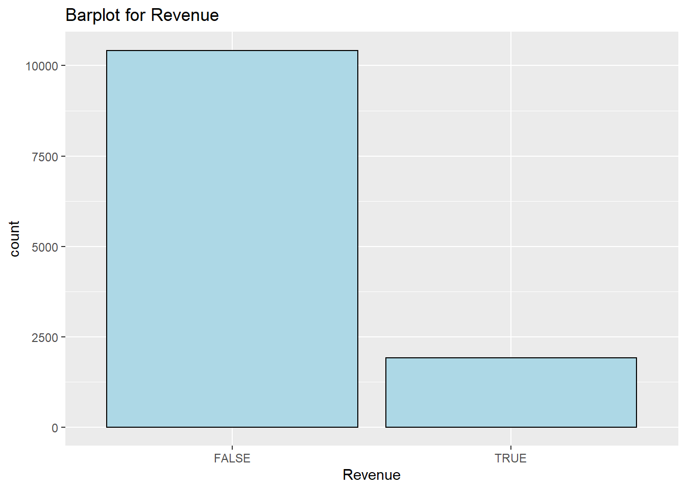
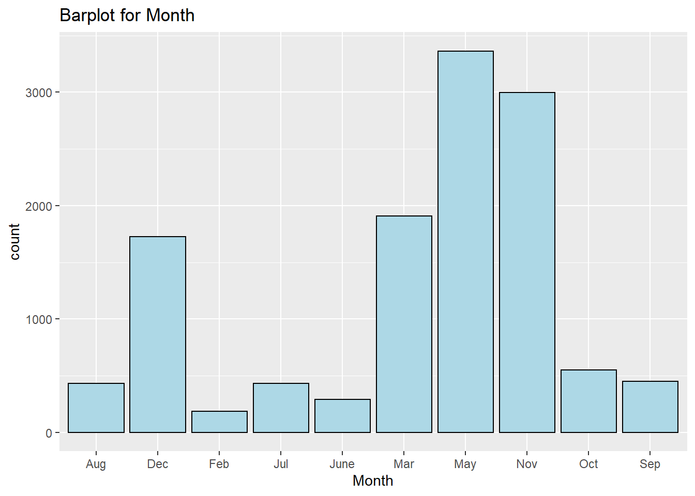
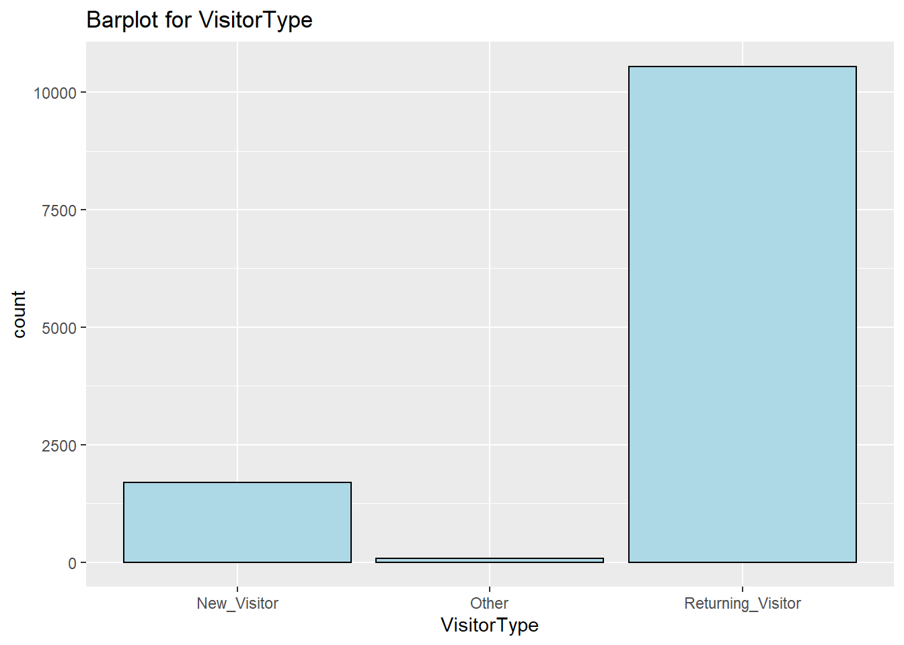
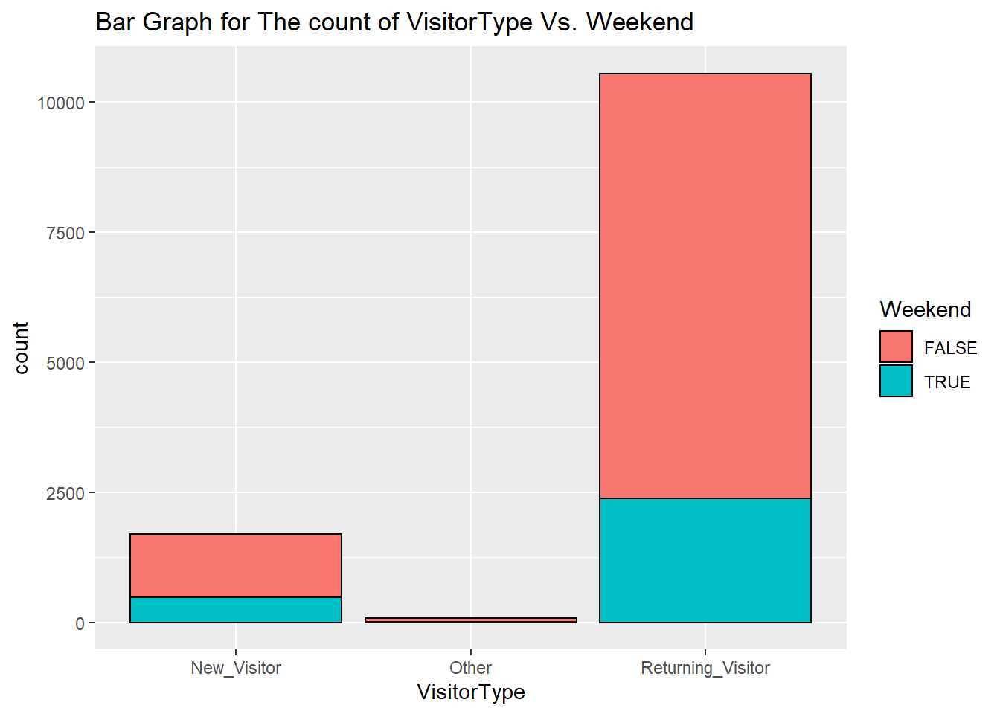
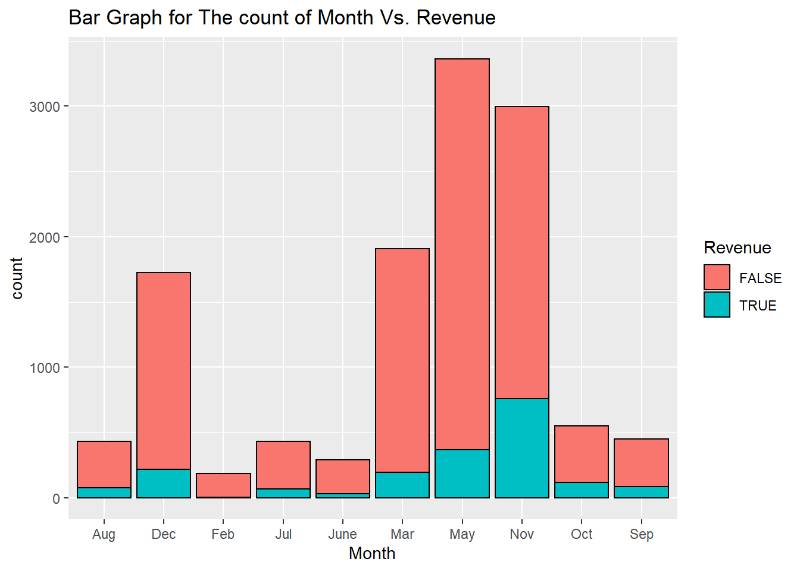
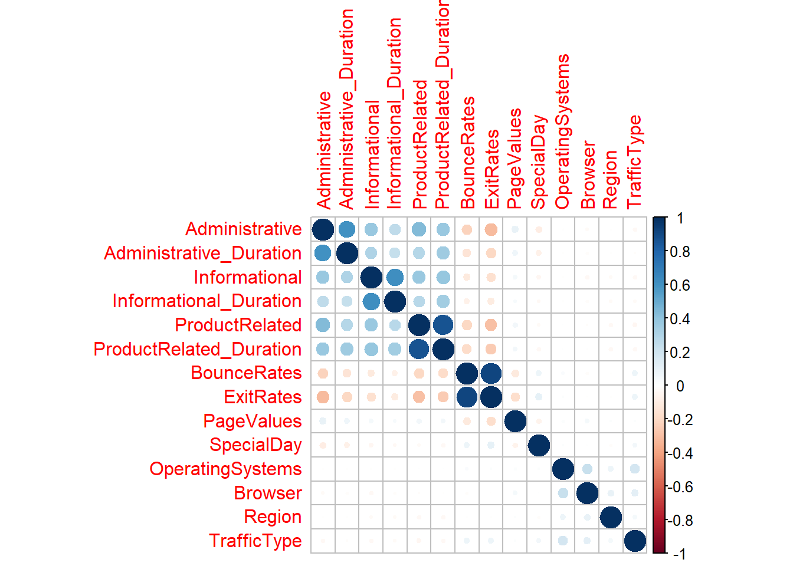
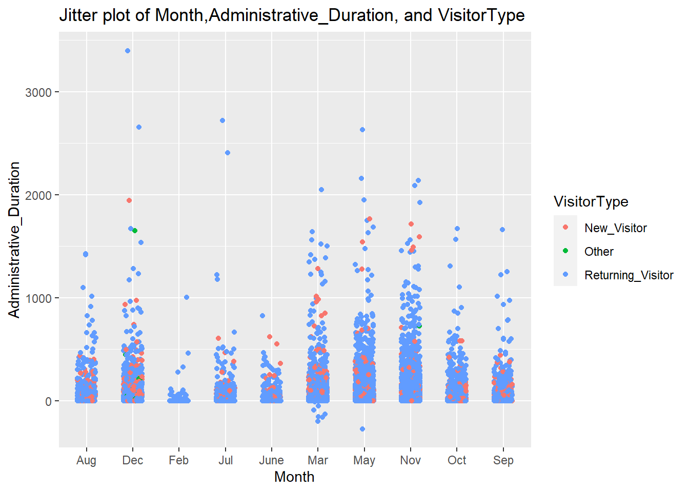
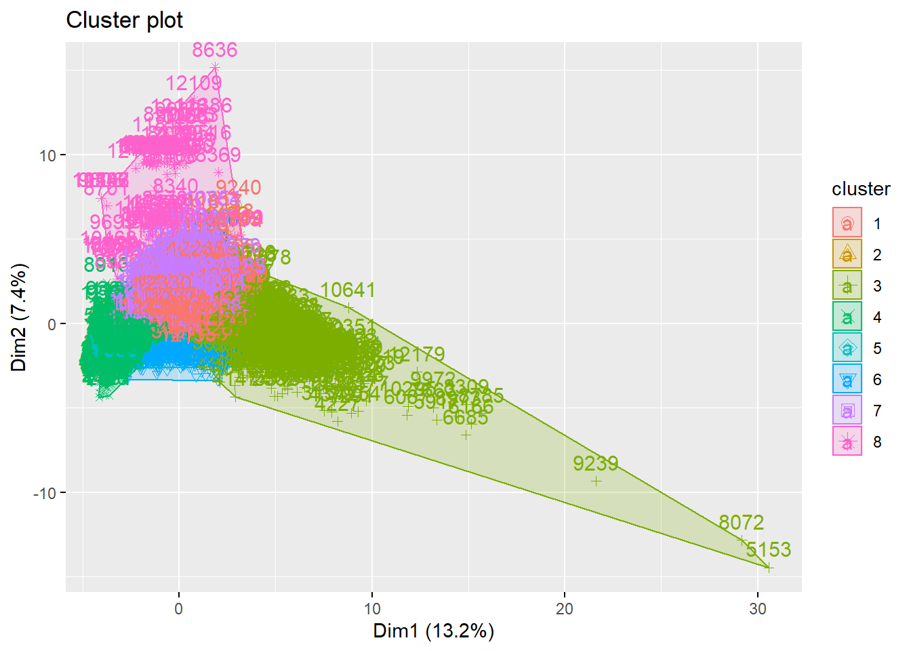
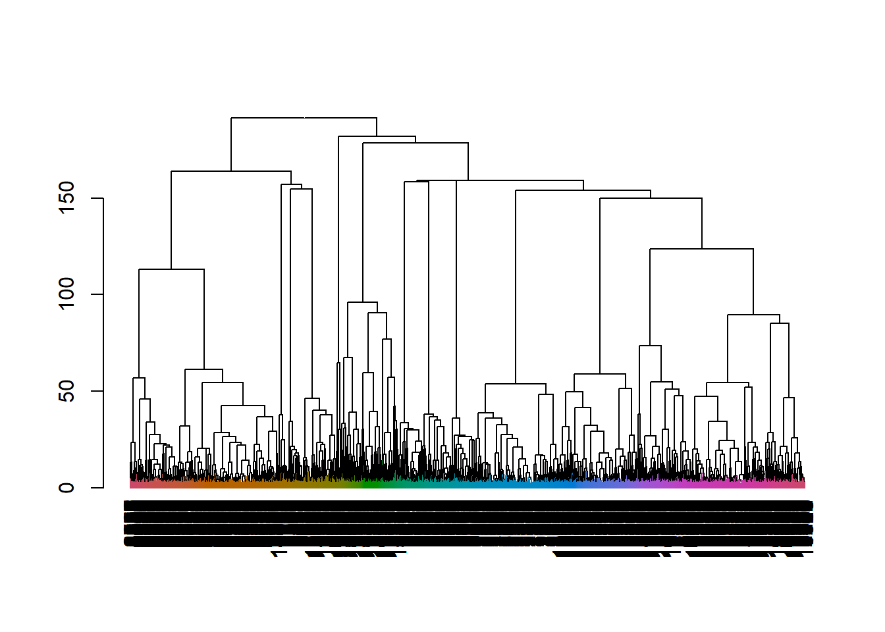

# Kira Plastinina-Company
Kira Plastinina is a Russian brand that is sold through a defunct chain of retail stores in Russia, Ukraine, Kazakhstan, Belarus, China, Philippines, and Armenia. The brand’s Sales and Marketing team would like to understand their customer’s behavior from data that they have collected over the past year. More specifically, they would like to learn the characteristics of customer groups.

# Defining the Metric of Success
The metrics of success for this project are:

  - Performing clustering stating insights drawn from my analysis and visualizations.

  - Upon implementation, provide comparisons between the K-Means clustering vs Hierarchical clustering approaches, highlighting the strengths and limitations of each approach in the context of my analysis.
  
# Understanding the Context
The project is centered around the Sales and Marketing industry. Customer segmentation is vital because it helps the business to get insights of the different customer segments, hence tailor their marketing accordingly.

# Recording the Experimental Design
For this analysis, I will perform the following actions:

Loading the Data.

Reading the Data.

Cleaning the Dataset.

Performing EDA:

Univariate Analysis.

Bivariate Analysis.

Multivariate Analysis.

Implement the Solution.

Challenging the Solution.

Follow-up Questions.

# Data Understanding
- The dataset consists of 10 numerical and 8 categorical attributes. The 'Revenue' attribute can be used as the class label.

- "Administrative", "Administrative Duration", "Informational", "Informational Duration", "Product Related" and "Product Related Duration" represents the number of different types of pages visited by the visitor in that session and total time spent in each of these page categories. The values of these features are derived from the URL information of the pages visited by the user and updated in real-time when a user takes an action, e.g. moving from one page to another. 

- The "Bounce Rate", "Exit Rate" and "Page Value" features represent the metrics measured by "Google Analytics" for each page in the e-commerce site. 
The value of the "Bounce Rate" feature for a web page refers to the percentage of visitors who enter the site from that page and then leave ("bounce") without triggering any other requests to the analytics server during that session.

- The value of the "Exit Rate" feature for a specific web page is calculated as for all pageviews to the page, the percentage that was the last in the session.
The "Page Value" feature represents the average value for a web page that a user visited before completing an e-commerce transaction. 

- The "Special Day" feature indicates the closeness of the site visiting time to a specific special day (e.g. Mother’s Day, Valentine's Day) in which the sessions are more likely to be finalized with the transaction. The value of this attribute is determined by considering the dynamics of e-commerce such as the duration between the order date and delivery date. For example, for Valentina’s day, this value takes a nonzero value between February 2 and February 12, zero before and after this date unless it is close to another special day, and its maximum value of 1 on February 8. 

- The dataset also includes the operating system, browser, region, traffic type, visitor type as returning or new visitor, a Boolean value indicating whether the date of the visit is weekend, and month of the year.

# The Project

Here is the [link](https://rpubs.com/Esther_O/911041) to my project on RPubs.

This is the [link](https://rpubs.com/Esther_O/908262) to the Advertising project I did before.

# Exploratory Data Analysis

## Univariate

The image below shows the univariate analysis of various variables:

## Bivariate

The images below show how various sqft_living, bedrooms, and condition:

Heatmap showing the correlation of all the variables:

## Multivariate

## Clustering

### K-Means Clustering

### Hierarchial Clustering

## Conclusion
- We had a total of 119 duplicated entries, which were all valid entries. They have similar values in some fields, but they are different entries. For that reason, we did not remove them from our dataset.

- We had a total of 112 missing values. We imputed the missing values using Amelia Technique.

- Our dataset had a dimension of 12330, 18 initially, and after imputing the missing values, we ended-up with the same dimension of 12330, 18.

- We select 3 numerical columns to compare their mean and standard deviation. The three columns we have chosen are: Administrative, ProductRelated and SpecialDay. From the three variables selected, we can see that two out of three (PageValues and ProductRelated) exhibit a high standard deviation, which indicates that the data points tend to be far from their mean. From this information, we can get an interpretation that the distribution of our data is not normal.

- From the skewness data, we gathered that most variables are highly skewed. This is because most variables have a value that is greater than +1.

- Most of the variable have a kurtosis that is >3. Compared to a normal distribution, its tails are longer and fatter, and often its central peak is higher and sharper, hence are leptokurtic.

- The page that has the highest maximum number of visitors is the ProductRelated Page. This means that most people visit the page when compared to Administrative Page (maximum of 27 visitors) and Informational Page (maximum of 24 visitors)

- TrafficType 2 has the highest count of visitors, followed by TrafficType 1,3, and 4.

- The highest number of visitors are Returning_Visitors.

- The highest month with the highest visitors vising the website is May, Followed closely by November, then march. The month of May could be having the highest number of visitors to the site because of Mother’s Day. It could be that most people are shopping for gifts. November is following closely probably because of Black Fridays, which happen in the month of November. Most people could be going to the website to look for offers.

## Clustering:
Between K-Means and Hierarchial Clustering, the better option is K-Means, especially using a cluster of 8. It gives detailed characteristics of the customers segments.

### Strength of K-Means Clustering
It give better visual representation of the clusters.

### Limitation of K-Means Clustering
-It is cumbersome to find the optimal number of clusters. Running the techniques of finding the optimal clusters, for instance gap method, is time-consuming.

### Strength of Hierarchial Clustering
We do not need to specify the number of clusters.

### Limitation of Hierarchial Clustering
It is a complex technique.

## Recommendation
For this project I recommend the use of K-Means Clustering with a cluster of 8.

## Follow-up Questions
What makes the rate of Returning_Visitors to be higher than the New_Visitors?
